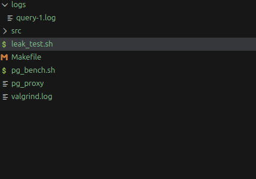
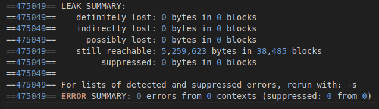
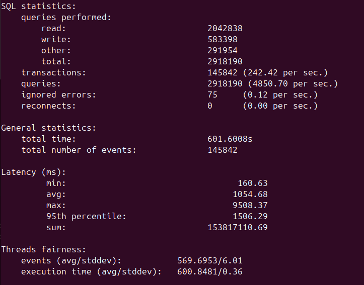
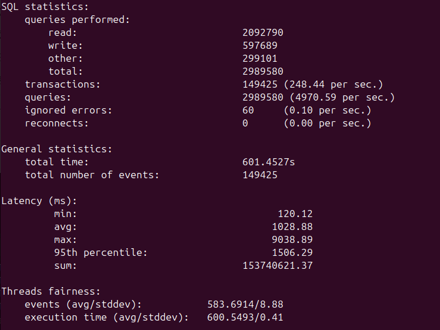

# General description

Lightweight high-performance PostgreSQL proxy written in C++.  
It accepts incoming client connections, forwards traffic to a target PostgreSQL server, and logs SQL queries with log rotation.

---

## Features

- Transparent TCP proxy for PostgreSQL protocol
- Event-driven using **epoll**
- SQL query logging
- Log rotation based on file size and file count
- Per-connection buffering and state tracking

---

## Build

Compile using:

```bash
make
```

## Usage

```bash
./pg_proxy <listen_host> <listen_port> <db_host> <db_port>
```

For bench script
```bash
./pg_bench.sh <mode>
```

where modes: 
ls -> light single:  TABLES=4  TABLE_SIZE=100     THREADS=4   EVENTS=1000
hs -> heavy single:  TABLES=8  TABLE_SIZE=500000  THREADS=256 EVENTS=50000
lt -> light torture: TABLES=4  TABLE_SIZE=200000  THREADS=64  TIME=300
lt -> heavy torture: TABLES=16 TABLE_SIZE=1000000 THREADS=256 TIME=600

For leak test with default parameters. Don't forget to load proxy during this run.
```bash
./leak_test.sh <mode>
```

## Logging 

Rotation logging is used. Max files by default = 10. Max size of file = 4 Mb



## Benchmark & Diagnostics

### Memory Leak Test (Valgrind)


### Proxy Benchmark Result


### Direct Database Benchmark Result


### Proxy vs Direct PostgreSQL Benchmark (256 threads)

| Metric                | Through Proxy | Direct to DB | Difference  |
|-----------------------|---------------|--------------|-------------|
| **Queries per second**| ~4850 qps     | ~4970 qps    | **~+2.5%**  |
| **Transactions/sec**  | ~242 tps      | ~248 tps     | **~+2.5%**  |
| **Avg latency**       | ~1054 ms      | ~1028 ms     | **~−2.5%**  |
| **95th percentile**   | ~1506 ms      | ~1506 ms     | identical   |
| **Max latency**       | ~9500 ms      | ~9038 ms     | Pretty close|
| **Total queries**     | ~2.918M       | ~2.989M      | ~+2.4%      |

## Summary
The proxy shows ~2–3% performance difference. The system is possibly bottlenecked by the database  
itself under 256 concurrent sysbench threads, not by the proxy. All test result looks good. No leaks. 
